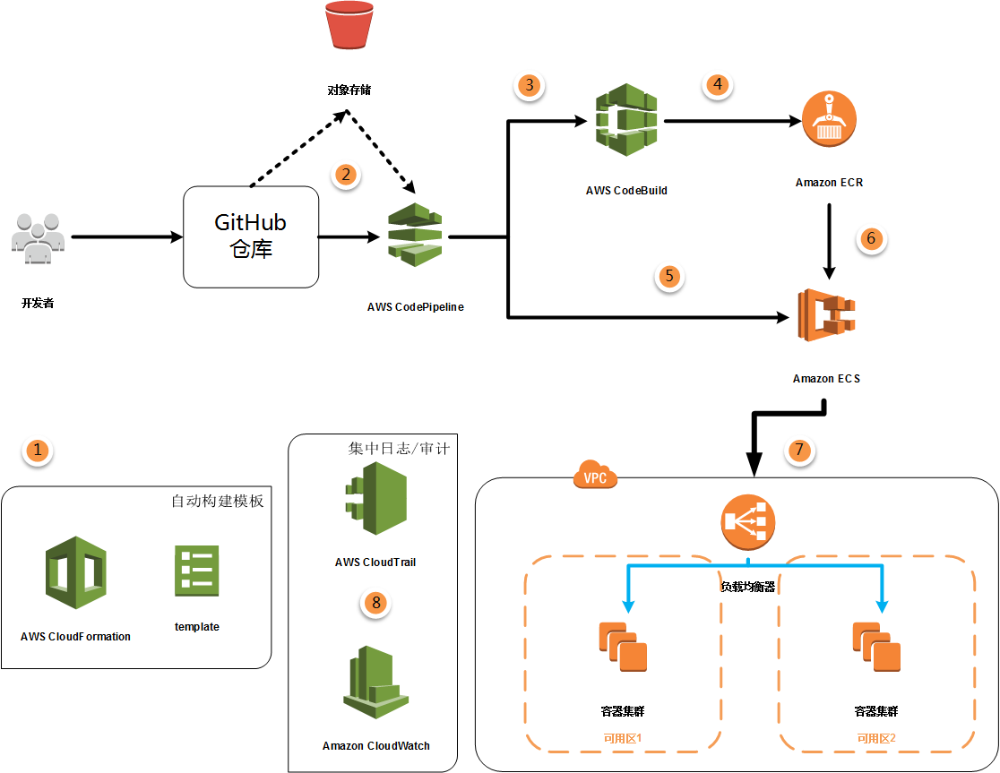
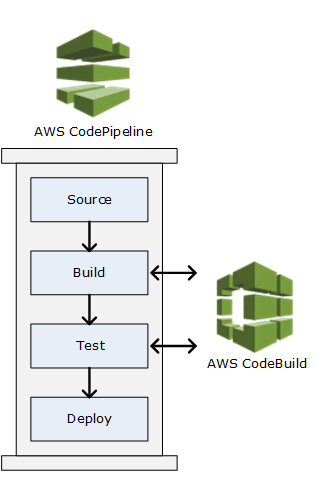
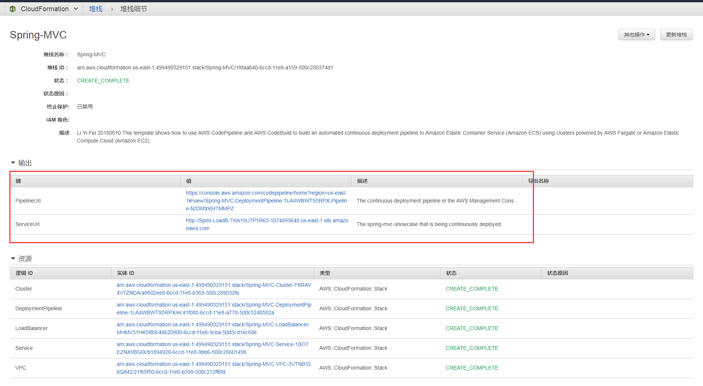

# 基于AWS的DevOps环境搭建

------

## 简介
基于AWS的CI/CD的本架构演示了如何使用CodePipeline和CodeBuild将应用程序连续部署到Elastic Container Service（ECS）上。通过持续集成/部署，软件修订版会自动部署到生产环境，而无需开发人员的手工操作，从而使整个软件发布过程实现自动化。

## 架构说明

1. 本项目的整套环境由CloudFormation模板自动化部署，只需要在模板创建的时候，输入容器类型、仓库名称、github令牌等。即可创建出包括Codepipline, Codebuild, VPC网络，负载均衡器等组件。

2. 开发者在Git仓库中commit/push后，即可触发交付件自动构建和测试、生产环境的自动部署。

3. 连接CodePipeline和第三方GitHub添加到管道，首先授权CodePipeline访问存储库，同时将创建 GitHub Webhook，以便当存储库中发生更改时启动相应的管道。源代码将会下载并暂存到S3对象存储中，作为输出供下一阶段的操作使用。

4. 上一阶段的输出作为CodeBuild的输入，在预配置的Java构建环境中编译源代码，运行测试，并生成可以部署的War包，然后打包成新的Docker镜像。

5. Elastic Container Registry (ECR)是一个完全托管的 Docker容器私有仓库，可以让开发人员轻松地存储、管理和部署 Docker 容器镜像。这里将CodeBuild打包的新镜像推送到指定的仓库中。

6. CodePipeline使用上一阶段生成的映像定义文件，去产生ECS任务定义的新修订，镜像URI指向新的提交。

7. ECS集群预定义了一系列的由任务（容器）组成的服务。ECS使用最新的修订，按照给定的集群设定逐步更新容器集群，并且将新的容器注册到负载均衡器上，注销旧的容器。负载均衡器可以监视并自动替换掉不健康的容器。

8. CodeBuild/CodePipeline与CloudTrail集成在一起，对所有的操作进行审计。还集成了CloudWatch集中保存所有组件的日志，也能保存容器集群管理的日志和每一个容器内部的日志。

如上图所示，CodeBuild 作为用于CodePipeline中管道的构建或测试操作。CodePipeline 是一种持续交付服务，它可以建模、可视化和自动执行发布代码所需的步骤。

## 文件结构
### 演示源代码
* /src
### Cloudformation模板
* ecs-refarch-continuous-deployment.yaml
* /templates

### 构建规范
* buildspec.yml
* Dockerfile
* pom.xml

** 部署方式
1. Fork 仓库，登录您的 GitHub 账户，并按照关于创建个人访问令牌的 GitHub 文档中的说明进行操作。确保配置令牌以包含以下 GitHub范围：admin:repo_hook 和 repo。记住并复制令牌。

2. 拷贝Cloudformation模板到公开可以访问的对象存储，已经拷贝到如下地址，点击 [这里](https://console.aws.amazon.com/cloudformation/home?region=us-east-1#/stacks/create/review?stackName=Spring-MVC&templateURL=https://s3.amazonaws.com/spring-mvc-showcase/ecs-refarch-continuous-deployment.yaml&param_LaunchType=Fargate) 即可直接启动模板（要求有AWS管理员权限启动）

3. 除了了个人令牌，其他值保留默认值。待运行一段时间之后，会出现如下界面的输出，ServiceUrl为访问网址，pipelineUrl为持续部署管道的管理界面。

## 其他设计
* 高可用，本架构以及使用容器集群和负载均衡实现了应用和网络上的高可用，因为应用是无状态的，数据持久化的高可用，可以选择RDS，S3，EFS等服务。
* 集中监控，CloudWatch可以很好的跟各项服务器监控，包括CodePipline, CodeBuild, ECR, ECS集群等。也可以设定告警管理并通过SNS订阅发送通知。
* 集中日志，CloudWatch可以集中收集CI/CD,容器应用，容器集群等各种日志并保存到S3存储里面。